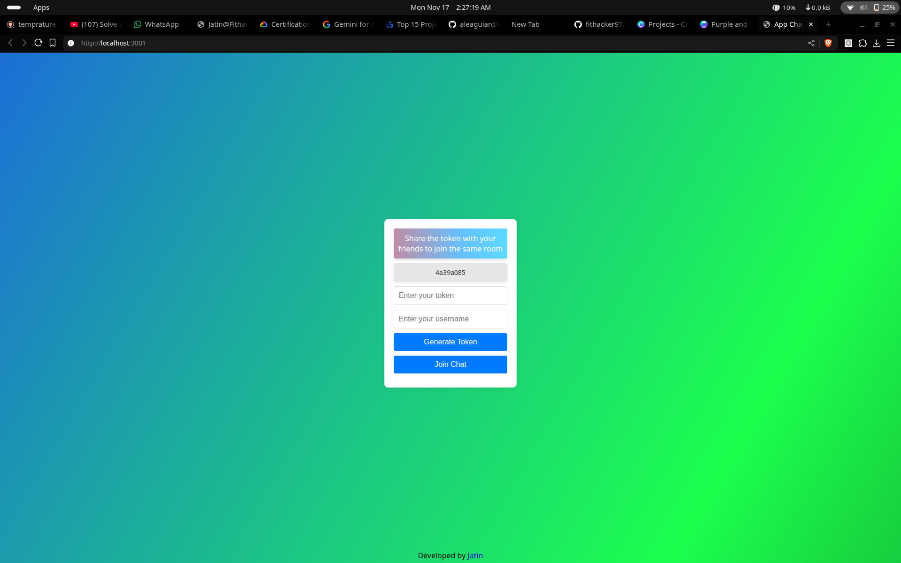

# **We Chat — Real-Time Chat App 🚀**

A lightweight, fast, and secure real-time chat application built using **Node.js**, **WebSockets**, and **token-based session joining**.  
This project enables users to join chat rooms instantly using generated session tokens — zero refresh, full realtime.

---

## ⭐ **Features**
- ⚡ Real-time messaging via WebSockets  
- 🔑 Token-based secure session joining  
- 🌐 Fully deployed & production-ready  
- 🏗️ Scalable Node.js backend  
- 🧩 Minimal and clean UI  

---

## 🔗 **Live Demo**
👉 **Live Link:** https://YOUR_LIVE_LINK_HERE  

---

## 📸 **Screenshots**

| Chat Screen | Token Join Screen |
|------------|------------------|
|  |  |


---

## 🛠️ **Tech Stack**
- **Node.js**
- **WebSockets (ws)**
- **Express.js**
- **HTML, CSS, JavaScript**

---

## 🚀 **Run Locally**

```bash
# Clone the repository
git clone https://github.com/YOUR_USERNAME/we-chat.git

# Navigate to folder
cd we-chat

# Install dependencies
npm install

# Start the server
npm start

